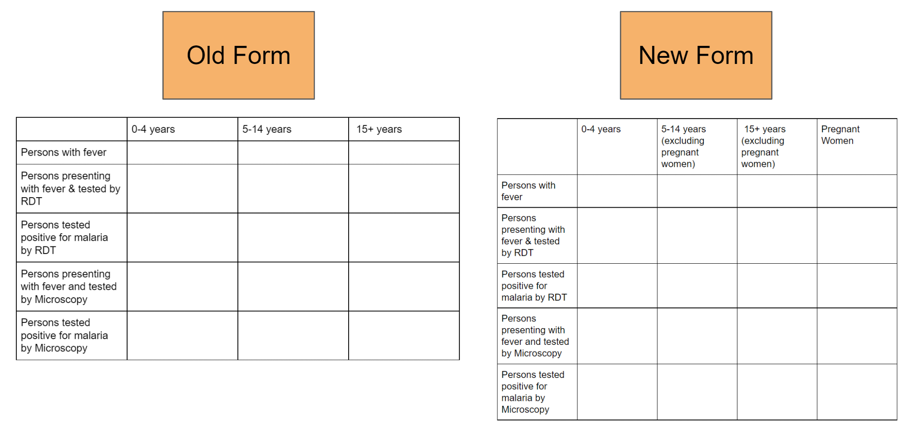
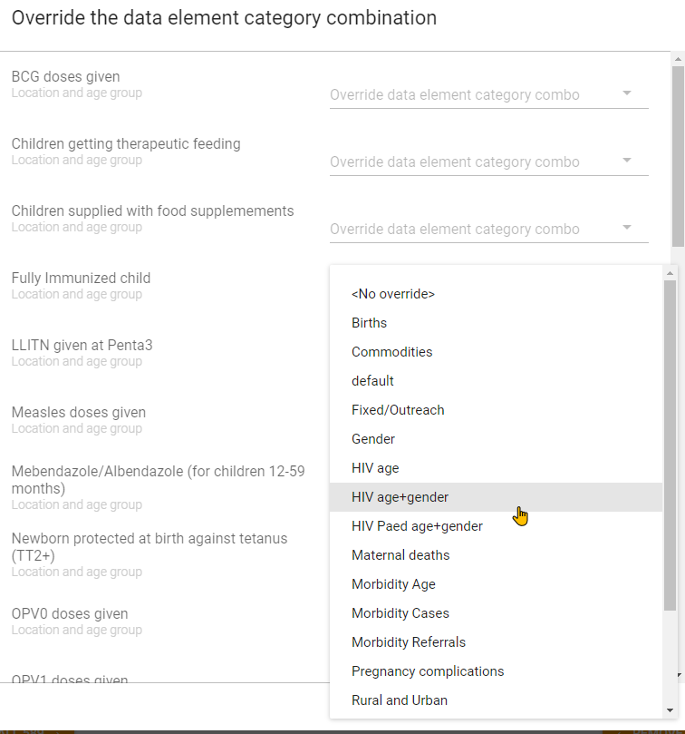

# Procedures for Managing Metadata
This sections discusses procedures and recommendations related to the long-term maintenance of metadata a DHIS2 implementation. It describes procedural challenges associated with co-ordinating long-term configuration processes and provides example standard operating procedures that can be adapted and used to better co-ordinate these processes.

Procedural issues that can result in complications when managing metadata include

- Development instances not available or not used properly
- Gaps in standard operating procedures (SOPs) for adding metadata or modifying the configuration
- Lack of coordination when adding new metadata
- Incorrect assumptions when adding WHO/standards-based digital data packages
- Revisions of data collection tools over time

## Development instances not available or not used properly

When working on your DHIS2 configuration, it is recommended that you have at least 1 development instance available for you to use. If you have more then 1 production instance, then you should consider having a copy of each of these instances for the purposes of creating new metadata or otherwise modifying your configuration (Figure 1).


**Figure 1**

Many metadata challenges result from users adding metadata directly on a production system. This metadata is either not configured correctly, or not used in the system resulting in changes that need to be cleaned up when discovered later on.

By using a development system you can avoid these challenges, as items on the development system should be able to be removed if not needed without any implications on the production system configuration or data.

## Standard Operating Procedures for adding metadata or modifying the configuration

SOPs for adding metadata should be available for all DHIS2 implementations. You can view some example standard operating procedures for adding [aggregate metadata](https://docs.google.com/document/d/1VXnF5KPfiD45h6wH04kUNShQVno--TmckMHMyLqZm5I/edit?usp=sharing) and [users](https://docs.google.com/document/d/1pqEQVV5JR7tyo8Zd09vDi3RVQ9E9R782OYNl-w9-5zQ/edit?usp=sharing) respectively.

When implementing a standard operating procedure, training on each specific procedure should be performed and evaluation of its implementation should continue until the defined procedure is standard practice. These procedures often go beyond the mechanics of customization/modification of metadata and require those that are adding to or modifying the configuration to closely consider how objects are added and the effect this has on the overall ease of use of the system. 

## Lack of coordination when adding new metadata

Beyond having specific procedures for adding metadata or modifying the configuration, these actions should be conducted in a co-ordinated manner. This co-ordination can be simple, such as internal discussions between team members, or complex, such as a committee who has an overview of all planned projects and can schedule modifications accordingly and will depend on the context of the implementation.

Lack of coordination can often lead to duplicate versions of metadata being created. As an example, if there are two admins adding the same new aggregate form within a system without informing each other, then a number of duplicate pieces of metadata will likely end up within the system.

In these scenarios, having a coordination mechanism outlined that informs those involved in configuring the DHIS 2 system what is happening can save significant time and effort later on as cleaning these duplicates can be a time consuming process.

## Incorrect assumptions when adding digital data packages

[WHO packages](https://dhis2.org/who/) or other standards based configuration that is being imported into a system may add a significant amount of duplicate metadata. As an example, packages solely use indicators on their dashboard. These indicators may be duplicates of existing data elements. In addition, if items in an existing system populated with existing metadata are not matched before a standards based package is imported, then this may result in duplicate items (such as category options, option sets, etc.) being created during the import.

As a general rule, when importing a standards based package, try to re-use as much existing metadata as possible. This will likely involve editing the json file for the package prior to importing it so that IDs in the import file match existing IDs in the system you are importing to.

For the dashboards, the duplicate indicators may not be problematic, particularly if they are grouped together correctly. This should be judged on a case-by-case basis to determine their impact on the system prior to importing the package.

**Note : Importing packages should always be attempted in a development system first. Only when all issues have been sorted out should they be imported to a production system**

## Revisions of data collection tools over time

When data collection tools are updated over time, measures can be taken to re-use various objects rather then create a duplicate version of them.  

### Programs

There should be no hesitation in reusing metadata between different event and tracker programs where possible. This metadata is always tied to the specific program that is being created and will maintain the required separation within the system.

### Data Sets

For aggregate data sets, re-use of metadata may be less clear. A common problem is when disaggregations are modified from one form to the next. Let us take the example outlined in Figure 2.


**Figure 2**

From this form we can see that the disaggregations for each of the data elements have been changed. Rather then create new data elements in which to apply these new disaggregations to; you can use a function called "Category combination over ride." This feature allows a data element to be associated with multiple category combinations over time.

To override the category combination, open up your data set from maintenance. Where you add your data elements, you will see a small wrench icon. When you hover over it it will say “Over ride the data element category combination” (Figure 3).


**Figure 3**

From here you will open a menu which lists your data elements on the left side and allows you to over ride the category combinations on the right side (Figure 4)



**Figure 4**

Just select the category combination for the data element you want to over ride using this menu.

**Note : You may need to create new category options, categories and category combinations. If you do, please review the example [aggregate metadata procedure.](https://docs.google.com/document/d/1VXnF5KPfiD45h6wH04kUNShQVno--TmckMHMyLqZm5I/edit?usp=sharing)**

This has the distinct advantage of allowing you to review the data within these re-used data elements over longer periods of time. Any data entered into these data elements using the old form can still be reviewed and compared with periods in which the the new form (and disaggregations) are being used. 

### Aggregate reporting rates

When creating a new data set that will replace a previous data set, you should consider rationalizing your reporting rates if needed, as the new dataset you make would not have any of your previous reporting rates associated with it by default. If you want to maintain the reporting rates together, you can export/import them from the old data set to the new data set so you can review all of the legacy reporting rates with the new ones together if that is needed. _You should test this process in a development instance prior to performing it on your production system_. Always take a backup before performing any import operations.

In order to retrieve the existing reporting rates, you can interact with the /completeDataSetRegistrations resource and use the following query

```
api/completeDataSetRegistrations?dataSet=XA8e9AVn8Vo&startDate=2000-01-01&endDate=2017-07-01&orgUnit=mPlB2jqKNP0&children=true
```

**NB:** note that you should replace the dataset ID in this example with the dataset ID in your own system, the dates with your dates that you require and the organisation unit ID's with your own IDs. In this example we are selecting the reporting rate from all child orgunits, so you replace the organisation unit ID with the parent ID.

This will return a result consisting of the following parameters for each period that is covered in your query.

```
{completeDataSetRegistrations: [{"period":"201408","dataSet":"XvcWsuHBsGA","organisationUnit":"ZUwksatWvE8","attributeOptionCombo":"HllvX50cXC0","date":"2014-09-15","storedBy":"automatic"}]}
```

Once you have retrieved the reporting rates, you can push them to the new data set using a POST request to the following endpoint

```
api/completeDataSetRegistrations
```

**NB:** note that you should replace the dataset IDs returned in the initial query with the dataset ID of the new dataset you are importing these reporting rates to. Do this prior to posting the information to the completeDataSetRegistrations resource.

### Linking historical data using indicators

In the event you have made new data elements to represent a concept that was partially represented previously, it may be worthwhile to create indicators that link these data elements together so this data can be viewed longitudinally over time (ie. you can view data from both new and old forms in one variable when you create an output). This principal operates under the assumption that there is no overlap in the data of the previous and new data elements (ie. they are not being collected during the same period, as this would result in the indicator having an incorrect/duplicated value).

In order to do this, create a new indicator and sum the previous data element(s) with the new data element(s). This will allow you to create various outputs that show both the historic and current data represented by the same variable within a single output. If you do not do this, you would have to select the 2 (or more) separate data elements that now represent this concept when performing analysis. This would also seem disjointed as they would be represented by different lines in a chart, different rows or columns in a table etc., with data only showing for the variables during the period in which collection was being performed.
