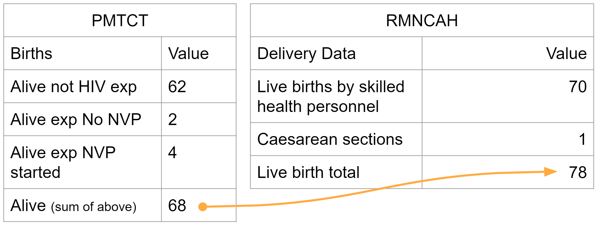
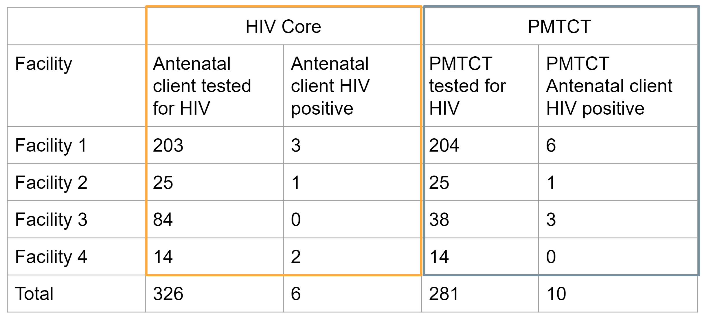

# Metadata integrity and quality assessment

While metadata quality can be somewhat subjective, there are a number of key principles that can be objectively assessed and should be universally followed throughout DHIS2 implementations. In order to assess metadata quality, a metadata assessment can be performed. In this context, we can define metadata assessment as the review of the quality of a specific implementations configuration. While this is wide-ranging in scope, our goal is to break down the assessment process into manageable pieces that can be reviewed, prioritized and fixed over time. Regular metadata assessment and ongoing upkeep is an important part of long-term DHIS2 configuration and maintenance. While configuration tasks can often be performed quickly through a number of different mechanisms, without proper co-ordination there can be a number of challenges that a DHIS2 systems configuration can face over time. Some examples of the effects of these configuration challenges include:

- An inability to find the correct items when creating data outputs
- An inability to correctly disaggregate data when creating data outputs
- An inability to access the correct items when either entering data or creating data outputs
- Challenges with data quality (some examples: significant inaccuracies in long term trends of data and reporting rates, being able to store invalid data values, multiple variables representing the same concept storing different data values)
- Difficulty identifying the correct items to use when configuring data exchange mechanisms  
- Errors when upgrading DHIS2 versions
- Having an overwhelming amount of invalid metadata to manage

The purpose of this guide is to provide tools and procedures to identify problems with metadata. A separate guide on [metadata maintenance]() is being developed that discusses  configuration practices that can lead to metadata quality problems, and discusses how these can be avoided e.g. by avoiding to do configuration work in production systems and establishing SoPs for metadata modifications. Finally, a section on [Working with metadata]() gives some guidance on how address metadata issues, such as removing objects that are no longer used.

Metadata maintenance and metadata assessment should be seen as related processes that feed into one another.

1. Reactive Process: As a result of configuration challenges, a DHIS2 system will need to be reviewed and cleaned accordingly.
2. Proactive Process: To prevent configuration challenges, processes can be put in place such that the DHIS2 configuration remains robust over time.

## Assessing metadata integrity and quality

Reactive processes are about assessing metadata to identify potential challenges, and addressing these challenges. This can be a demanding process that needs to be properly planned, with time and resources dedicated to identify and resolve issues. While the planning and execution of a metadata assessment is discussed briefly [below](), the focus in this guide is on the more practical and technical aspects of assessing metadata and addressing common issues.

This guide focuses primarily on two approaches to assessing metadata: 

1. through a [metadata assessment tool]() that can be connected directly to DHIS2 perform metadata checks, and 
2. through [manual review of metadata]().

Both of these approaches are described below.

### Planning and performing a metadata assessment

In order to perform the assessment, you may want to start by getting buy-in from a wide variety of stakeholders. In doing so, it may be useful to document the extent of the issues discussed within this guide by generating summary statistics on the problems that have been identified. This can be very useful to present to a large audience and can be used to support buy-in by providing brief explanations of the issues that have been identified. Within the **Metadata Assessment Reference Guide** you will find tools that will support you to both create quick summary counts of problems that you find in your own implementation as well as tools that generate more detailed reports on each specific item that requires attention. We recommend that the assessment includes the following components:

1. Define the scope of the assessment and sharing this with relevant stakeholders
2. Identifying the extent of the problems within an implementation through generating and documenting summary statistics of what has been found
3. Presenting these findings back to the group of stakeholders
4. Identifying the individual items that are problematic and coming up with strategies to mitigate or fix them as appropriate
5. Detailing and prioritizing the fixes
6. Implementing these fixes on development followed by production systems

## Manual review of metadata

While time saving measures through the use of the data integrity check or SQL scripts have been made available, some review processes can not be automated. This includes the review of:
  - Naming Conventions
  - Indicator Formula
  - Duplicated data sources
  - Dashboard item configuration
  - Program and dataset organisation unit assignment
  - Program and dataset sharing

### Naming Conventions

For a full breakdown on the principles behind good naming conventions, please view this [resource](https://docs.dhis2.org/en/topics/metadata/dhis2-who-digital-health-data-toolkit/naming-conventions.html). Where possible, you should consider implementing these in the system(s) you are reviewing.

To update the names of your metadata in bulk, consider using the [DHIS2 metadata editor](https://workspace.google.com/marketplace/app/d2_metadata_review_tool/672531419470). This will allow you to edit all of your metadata in a google sheet and synchronize your information back to the server. You can view the full guide for the metadata editor [here](https://docs.google.com/document/d/1Y4u78llIOTb5gNPHLJks528kbz8czXH9O6yKMEaLFI0/edit?usp=sharing).

### Indicator Formula

A manual review of indicator formula may be needed in order to determine if the indicator formula are correct. The review of indicator formula, while potentially a configuration issue, has the potential to affect data quality and data outputs if incorrect assumptions are being made about the formula. Examples of issues you will want to check when reviewing indicator formula include:

1. Ensuring that the correct data elements are part of the numerator and denominator respectively by comparing the data elements with the numerator and denominator descriptions
2. Ensuring that the correct indicator type has been selected for the indicator being reviewed
3. Where possible, reviewing that the denominator is defined correctly (however; this may be more of a data quality issue and left for a more detailed data quality review exercise)

You can use the [DHIS2 metadata editor](https://workspace.google.com/marketplace/app/d2_metadata_review_tool/672531419470) to review some of the formulas if you are familiar with how this is set up, however a more traditional method of browsing indicators through the user interface can be done using the [WHO metadata browser app](https://apps.dhis2.org/app/af9a31fb-350c-4130-964b-3a413183aa54).

### Duplicate Data Sources

Duplicate data sources arise when you have multiple variables within a DHIS2 system reporting on the same concept. There are typically 3 types of duplicated data sources that you may see in DHIS2:

- Duplicate variables within the same data collection form
- Duplicate variables between different programs (usually on different forms)
- Duplicate variables within programs (either on the same or different forms)

#### Duplicate variables within the same data collection form

This occurs when one or more data elements is providing a total that is duplicated by one or more other data elements on the same form. As an example, we can review the forms available in Figure 1.

**Figure 1**

When this occurs, it is difficult to determine what is the correct value.

#### Duplicate Variables between different programs

This occurs when you have two or more programs within an integrated system that are collecting the same information (Figure 2). In some cases programs can not agree on the value and this may need to be maintained as is. This will become problematic when trying to determine an agreed national value however as the values may be different between the different programs and this is not recommended to be maintained as is.

**Figure 2**

#### Duplicate variables within programs (either on the same or different forms)

This occurs when the same information is being collected within the same program (Figure 3). This can be problematic as there should be agreement between values when possible (and this may not be the case when this issue is found)

**Figure 3**

#### Resolving duplicate data sources

Similar to issues with defining denominators, this may need to be left for a more detailed data quality review. As these findings will often require form review/revision across various programs in order to rationalize these duplicate data sources, this issue will likely not be resolved through an immediate configuration change. It is important to identify these issues however and work with the programs to resolve them based on local procedures.

### Dashboard Item Configuration

There are two considerations to make when you are reviewing dashboard items:

1. Does the dashboard item need to be shared to be viewed by the user groups the dashboard is shared with
2. Does the dashboard item need relative organisation units or periods applied to it so it can be re-used/updated regularly

If it is the case where a dashboard item needs to show data for a fixed period or organisation unit, then there will be no need to apply any relativity to the item. If the item should be updated with new data routinely, or the users in which the dashboard is shared with do not have access to the fixed organisation units selected within the item, then these items should be reviewed and updated with correct relative period and organisation unit selections as appropriate.

### Program and data set organisation unit assignment

Check if the programs and data sets are assigned only to organisation units that are expected to report on them. For datasets this can cause problems with reporting rate completeness (the number of expected reports may be higher then it should be) and potentially data being entered where it should not be; while in the case of programs you could have tracked entities and/or events registered in organisation units they should not be.

#### Moving Aggregate Data

#### Moving Tracker Data

### Program and data set sharing

Check if the metadata and data sharing settings have been applied correctly to both programs and data sets. In particular, if there are users or groups of users that can not perform operations on the programs or data sets that they should be able to, then these sharing settings may need to be modified.

A more detailed breakdown on the application of sharing settings to programs and data sets can be found in both the [documentation](https://docs.dhis2.org/en/use/user-guides/dhis-core-version-master/configuring-the-system/about-sharing-of-objects.html) as well as through a number of videos on [YouTube](https://www.youtube.com/playlist?list=PLo6Seh-066RwslDmyZkiKjejgMCKNaJTC).

### Todo - other
| **Additional checks**     													|   	|
|------------------------------------------------------------------------------	|---	|                                                                      	
| Category options should be unique (conceptually)                              |   	|